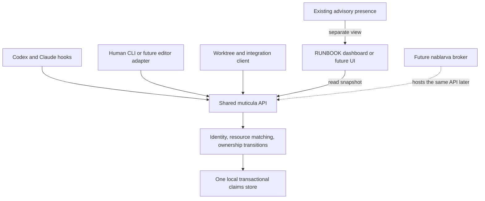

---
what is it:
created: 
session-role: "Briefing substrate retained; RUNBOOK.md is the session launcher and STATUS.md owns current work"

---

> **Converted to standardized session operation, 2026-09-24:** read
> [RUNBOOK](../RUNBOOK.md) and [STATUS](../STATUS.md) before acting on this source.
> The original text and muticula proposal below are retained as briefing evidence.
> Their earlier planning/hold language is historical; current authority and next action
> come from those control files. The wider animal design remains with nablarva's
> `AGENTS.PROJECT-DESIGN.md` convergence maintainer.

# 1. what is it

> decission where we go now and next,
> this should be architectural session also claude (oraculum | trajectory) + codex (now cartan).

## 1.1. nablarva *(itself)*

- agentive framework, multisession drive, decentralized rag connector
- multisession driwing -mesage buss and control mechanism over vendors and sessions


---

# 2.process

1. read all first -> reconsiliation
2. `~/ia-sync/zsh/session/`-> look please on all runbook-tool sessions . `-00` is finished, `coordination` should be also. but need check if anything is not flying.

## 2.1. planning phase

**questions which should be answered**
1. wrapper| ui -> still terminal or some terminal wraper + process window -> real app -> than build should move seriously to `~/unikuklatrix/nablarva/.dev/session/toobox-instarmux
2. but also prepared for your advices

# 3. APP parts

## 3.1. termbrana

 - semitransparent foil allowing one typewriting system over all (keys, shortcuts, lighter navigation for terminal inputs -> agentive UI)
 - bridge between terminal, ai session, browser (firefox), files
 - example: have file on line nr. xxx will add `NOTE<nr>` -> open appropriate buffer collector for notes -> I can attach ai session on specific notes, same should be allowed in browser by press any key I can make note with address and anchor to specific HTML part or  
 - requires `instatmux` -> dashboard part with sessions
 --> if to much - heavy on one toobox can be splitted to parts per scope of process. 

---

## 3.2. ovitmugen *(tool)*
- origin `instar` - phase session (taken from biological names), `tmux`
-> tmux manager - part of runbook tool
- reconsiliate if columns are enough layout, I assume growing needs more space, untill today it was only helper
- holding session dashboard

###### function ADD
- click on some selected session vault, run tmux manager over it (user
  should fill session name, number of 'columns' - I assume windows and name for bed - postures, we can have generic fallback - default_(n), cSharp, bus,... I can add to existing scheme also new beds for another agentive sessions
## function create
no bond to specific `.dev/session/<specific-session>`

## another managing options
 like 
 - kill whole tmux session, extend to another beds


### 3.1.1. demanded tree

```tree

└── global-tmux-session # majkee: assume per <slug> f.e.. maybe I am not understanding what session is here (coliding to twins?)
    │
    ├── window_1 # f.e. bed for agent who will drive task proces like cSharp (somebody in charge)
    │	 └── cSharp # pane, majkee: still not understanding why is pane something different from window
    │
    ├── window_2
	...	 └── bus # here is another agentive session with different task


```

--> **reconsiliate** if columns are enough layout, I assume growing needs more space, untill
  today it was only helper

### 3.2.x. @Trajectory notes — tips, observations, upgrade ideas *(append-only, dated)*

> Full architecture: `~/unikuklatrix/nablarva/.dev/session/ovitmugen-00-console/raw/draft.trajectory.ovitmugen-architecture.2026-09-23.md`
> These notes are the short, growing layer on top of it. Newest at the bottom.

**2026-09-24 · answers to the inline questions in 3.1.1**
- *"what is session here, colliding to twins?"* A session = a named group of windows. It
  remembers **one** current window, so two terminals on one session always show the same
  window (the twins). Fix: every terminal column gets its own **view** session (`<slug>--<win>`),
  sharing the same windows. Columns are then independent.
- *"why is pane different from window?"* Window = a whole screen (a tab). Pane = a piece of
  that screen when you split it. Every window has at least 1 pane; the agent runs in the pane.
  One agent per window → you can ignore panes.
- *"are columns enough layout?"* Yes, with layout C: the left pane switches between tabs, so
  it grows by adding **tabs**, not columns. Screen width stops being the limit.

**2026-09-24 · decided so far** (source: architecture doc §1, §5.7, §9)
- layout C: frame (own tmux server `ovitmugen`) + agents (normal tmux) · left = tabs, right = runbook fixed
- split 60/40, live resize `C-a <` / `C-a >` · prefix `C-a` (`C-a C-a` = shell start-of-line)
- tabs = empty shells, agents started by hand · console = one view: popup `C-a t` / runbook `T` / `ov`
- docs in nablarva · build in `~/ia-sync/zsh/session/` → `bash deploy.sh`

**2026-09-24 · tips (learned the hard way, 2026-09-23)**
- **Address by ID, not by name**, after creating anything. One session had two windows named
  `bus`, and any `:bus` target became a guess. tmux hands back IDs (`@12`, `%7`) at creation.
- **`=` on a pane target fails** (`=frame:0.1` → can't find pane). `=` is fine for session/window.
- **Name the tmux server in every call** (`-L default` / `-L ovitmugen`). runbook runs *inside*
  the frame, so a bare `tmux` from runbook would hit the frame, not the agents.
- **`window-size largest`** (`~/.tmux.conf`): a tab seen in the narrow left pane *and* on the phone
  gets sized to the phone's width, so the left pane crops. Plan: per-window `window-size latest`.
- Safe-kill rule used in the cleanup: a pane hosts an agent if its command isn't a bare shell
  **or** the shell has child processes. Never kill those.

**2026-09-24 · principles worth keeping beyond ovitmugen** (candidates, not law)
- **A viewer never owns lifetime.** Frame, termbrana foil, a future GUI: they only *show*.
  Closing a viewer must never kill an agent or the broker. Direct consequence for nablarva
  docket 4 (broker as a tmux pane): the broker gets a **tab in the agents server**, never a
  pane in the frame.
- **Dry-run = the manual recipe.** Every zsh/py brick's `--dry-run` prints the literal
  commands; that output is the HELP. Tool and docs can't drift apart.
- **ovitmugen never types into panes** (no `send-keys`, nablarva L4). It switches *views* only.
  If someone asks "can ovitmugen send the prompt to tab X?", the answer is no; that's the bus's job.

**upgrade ideas (not scheduled, pick when needed)**
- `ov ls --json` → termbrana reads it as its dashboard source (3.1 "requires … dashboard part with sessions")
- phone view `<slug>--phone`: the phone attaches to its own view and never steals the left pane's tab
- permanent console pane as a preset option (`"fixed": ["runbook","ovitmugen"]`) if the popup gets used constantly
- t41 folds into ovitmugen (`t41` = thin alias over `ov up`), one preset file for both
- cross-host frame: home shows office agents (`ssh -t office tmux -L ovitmugen attach`), nablarva Stage 2
- tab badges in the console: `●` agent running · `○` empty · later `!` = agent waiting for input (read-only signal, never input)

---

## 3.3. instarmux *(tool)*

## 3.4. reposoma *(tool, not `~/reposoma` - this is substrate)*

## 3.5. muticula *(tool)*

- origin `mutex` × Latin `cuticula` (small skin) -> protective skin around work in progress
- concurrency guard for sessions, agents and subagents across vendors
- coordinates who may edit which files -> claim, work, hand over, release
- protects shared work from overlapping writes; enforcement and cooperation rules still to be designed

### 3.5.1. Architecture proposal — Cartan · 2026-09-24

For majkee + Cartan + Trajectory (`ff-sync.trajectory.cSharp-dashboard and worktrees`).
**Design only; the following choices are proposals, not an opened RUNBOOK or permission
to build/deploy.** Muticula's name and purpose above come from majkee.

Working component detail stays in this original file at majkee's request. The moved
project wrapper is
[`AGENTS.PROJECT-DESIGN.md`](/home/hruzam/unikuklatrix/nablarva/.dev/session/AGENTS.PROJECT-DESIGN.md),
maintained by its separately attached Cartan. Its maintainer can link this section;
this sitting does not edit or synchronize that copy. Muticula's later home under
nablarva is a placement step, not a restriction to protecting nablarva's own files.

**Purpose:** coordinate concurrent writing across projects, vendors, agent instances,
subagents, and participating human tools. The first interface can be our existing
terminal/session tools. The core should remain usable from a future application,
editor, or broker without rewriting ownership rules.

**The open epistemic question stays open:** does a terminal browser plus small tools
remain sufficient, or does the work require an application with its own process
manager? We have a terminal foundation today. Its availability is evidence of what
we can build on, not evidence that it should define the final application.

### 3.5.2. Grounding and boundaries

On disk, the current session entry point is `zsh/session/base.zsh`; there is no
`zsh/session/session.zsh`. It sources `keyboard.zsh`, `runbook.zsh`, and `board.zsh`.
`runbook.py` implements the browser and current board client. The similarly named
`zsh/projects/session.zsh` serves the separate `~/www/session` project.

| Existing surface | Relationship to muticula |
|---|---|
| `session/base.zsh` + `keyboard.zsh` | Thin shell entry points; sourcing continues to define only, with no automatic acquisition |
| `runbook.{zsh,py}` | First browser/dashboard client; selected bed is context, not proof of a writer's identity |
| `board.zsh` + `~/reposoma/_active/` | Existing advisory presence; preserve its contract and records |
| ovitmugen | Shows sessions/views and ownership results; viewing or closing a frame grants/releases nothing |
| Native agent hooks | Bind the runtime instance and intercept supported operations before execution |
| Worktree tooling | Supplies isolated checkouts and explicit integration; consumes coordination decisions |
| Future nablarva broker | Can host the same coordination API and deliver notices; does not become a second claims authority |

`RB_ROOT` chooses a browsing bench. It must never silently choose the protected
checkout. Every writing request resolves its actual cwd/checkout and resource paths.
A RUNBOOK bed is optional: direct maintenance, a plain folder, and a human edit can
participate without inventing a session directory.

Three facts remain separate: **presence** says someone declared attachment;
**reservation** says which participant holds a write scope; **operation admission**
says a particular covered operation may proceed under that reservation. None grants
project authority that the participant did not already have.

### 3.5.3. Bricks and direction of control



The hook consults the **shared authority behind the dashboard**. The dashboard may
be closed or showing an older snapshot; it is never in the write decision path.
Hooks and clients do not write registry files independently.

| Brick | Owns | Does not own |
|---|---|---|
| Identity binding | Unique actor incarnation; runtime/parent references; explicit reattachment | Inferring identity from a seat label, tmux tab, or OS username |
| Resource resolver | Host, physical checkout, canonical paths, named shared resources, overlap rules | Guessing that equal repo names mean equal physical files |
| Coordination core + store | Atomic acquisition, admission, release, handoff, recovery receipts | Scheduling tasks, editing project STATUS, moving files |
| Runtime adapters | Native hook input/output, identity and tool coverage, concise conflict context | Vendor-specific copies of ownership policy |
| CLI + dashboard | Inspection, deliberate requests, coverage/uncertainty display | Independent mutable ownership state |
| Isolation/integration client | Worktree plan/apply, baseline, selected transfer, integration owner | Automatic merging, deployment, or migrating a running session by changing its display |

The semantic operations are `register`, `inspect`, `acquire`, `begin-operation`,
`finish-operation`, `release`, `handoff`, and explicit operator `recover`. These are
design vocabulary, not final CLI names. Read-only `inspect`/plan calls never reserve.
Mutation requests carry stable request IDs so a retry cannot duplicate a transition.
Responses distinguish granted, conflict, unsupported coverage, and unavailable state;
they identify the conflicting owner/scope and the next coordination path.

### 3.5.4. Identity, resources, and the smallest useful state

Each attached writing incarnation receives a random `actor_id`. Keep its native
thread/session reference, parent actor if any, task/bed pointer, host, and coverage
description as metadata. A resumed thread must explicitly recover or rebind ownership;
a reusable thread ID or seat name does not silently take over an old actor's claims.
Persist binding for that incarnation, not in a user-wide “all my IDs” ownership bucket.

Subagents are distinct potential writers. Sharing a parent does not grant overlapping
write access. Transfer a claim or assign disjoint scopes; the parent cannot keep writing
the delegated scope. Native identity must be demonstrated at the actual write hook.
Codex currently documents that subagent hooks use the parent's `session_id`, so that
field alone is insufficient. If an adapter cannot distinguish concurrent writers, that
lane remains unsupported for independent guarded subagents; do not invent ownership
from labels. A single serialized controller lane is a narrower possible fallback.
[Codex hook fields](https://learn.chatgpt.com/docs/hooks#common-input-fields)

Proposed resource types:

- **File or directory subtree:** host-qualified canonical physical path. Directory
  overlap uses path components; `src/a` does not include `src/abc`. Creates resolve the
  existing parent plus the new suffix; renames require source and destination coverage;
  directory moves/deletes cover affected descendants. Aliases/symlinks and existing
  hardlinks need explicit matching or a clearly rejected unsupported case. A changing
  symlink cannot be treated as proven confinement by a one-time path check.
- **Git transaction:** checkout/index identity, held from staging through review and
  commit or explicit withdrawal. Branch/ref-changing operations can affect other
  worktrees and require the corresponding shared repository scope. File claims alone
  do not prevent another session's staged hunks entering a commit.
- **Named external resource:** for example a host's deployment target. Two worktrees
  still deploy to the same live directories. Only add other resource kinds as real
  consumers need them.

Different worktrees contain different physical source files and may edit them in
parallel. Their common logical changes meet at integration. Absolute paths back into
the main checkout and shared external directories remain shared physical resources.

The store needs actors, claims (`claim_id`, owner, resource, generation), admitted
operations, and small transition receipts. Store metadata/reasons, not transcripts or
source-file contents. A claim ID is an identifier; adapter binding supplies ownership.
This coordinates cooperative tools under one local account, not hostile processes
with that account's filesystem privileges.

### 3.5.5. Write and handoff lifecycle

1. **Bind and declare.** Register the actor; declare intended write scope and integration
   owner. Inspect pre-existing working and staged changes before claiming responsibility.
   A newly acquired claim never implies authorship of existing content.
2. **Acquire the complete set atomically.** Resolve all requested resources and either
   reserve all of them or change nothing. On expansion, keep existing claims and reject
   a conflicting addition. Return promptly with a conflict, rather than letting actors
   wait indefinitely while each holds half of the required resources.
3. **Read the current baseline.** Prefer claiming before the read/edit cycle. If analysis
   used earlier contents, reread after acquisition; an old patch is not made current by
   winning a reservation. Covered edits validate the expected base where supported.
4. **Admit each mutation.** The synchronous hook resolves the actual operation, checks
   actor, claim generation and coverage, and records an operation ID before allowing
   execution. Two overlapping mutations from the same actor also need serialization.
   No fresh operator question is needed within an already authorized, uncontested scope.
5. **Finish the operation.** Record completion/failure against that operation ID. Keep
   the task's reservation; one tool returning or one model turn ending does not release it.
   Detached/background writers cannot be marked finished merely because their launching
   shell command returned; exclude them from guarded v0 unless their lifetime is tracked.
6. **Release or hand over.** An explicit owner request closes admission, drains admitted
   operations, and then releases/transfers the exact claims in one transition. The next
   owner receives the current dirty-state/baseline and rereads it. An old generation is
   rejected on future admission. Closing a terminal view changes none of this.

If the owner or completion hook disappears, mark uncertainty and retain the reservation.
V0 has no automatic expiry/takeover. Recovery requires confirming that the old writer
and child processes are stopped/drained before operator reassignment. A generation
check cannot stop a write already admitted to an uncontrolled process. No heartbeat,
timestamp, or missing presence record proves that recovery is safe.

### 3.5.6. Enforcement coverage and local storage

Proposed v0 promise: prevent conflicting admissions among enrolled participants using
the specifically tested tool paths. Display three distinct conditions: covered by an
active tested adapter; declared scope with cooperative enforcement; unregistered/unknown.
Show coverage per operation class, not a universal “protected session” badge.

Explicit edit tools are the first target. Arbitrary shell scripts, formatters, package
commands, and human editors may touch paths absent from their command text. A declared
directory expresses intent but does not confine those processes. Unknown mutation paths
must be refused in a strict guarded lane, or explicitly treated as cooperative work;
they cannot receive a green result through a guessed shell regex. Wider protection
requires a controlled execution wrapper/sandbox or separate checkout with named external
resources still coordinated. Reading can remain available without exclusive claims.

Both runtimes document pre-tool blocking hooks, but their event and failure behavior
differs. Adapters must translate conflict and helper-unavailable results into a tested
native refusal. Guard hooks must be synchronous. Missing/untrusted/skipped hooks, hook
crashes, timeouts, continuing shell input, and tool paths outside coverage are acceptance
cases; a healthy registry cannot compensate for a guard that never runs. In particular,
Codex documents that `write_stdin` does not rerun `PreToolUse`. Enrollment must establish
coverage, and the UI must expose degraded/unknown status rather than infer safety.
[Codex hooks](https://learn.chatgpt.com/docs/hooks) ·
[Claude hooks](https://code.claude.com/docs/en/hooks#pretooluse)

**Smallest local implementation candidate:** a short-lived CLI/library helper backed
by one machine-local SQLite database. All overlap checks and ownership mutations occur
inside one write transaction; multiple hook processes call the same implementation.
`BEGIN IMMEDIATE` provides an early writer transaction, with bounded handling of busy
state. The transaction lasts only for the decision, never for a model turn or file edit;
persisted claims and admitted-operation records carry the longer lifetime.
[SQLite transactions](https://www.sqlite.org/lang_transaction.html)

Candidate state home: an XDG state directory for muticula, outside repositories and
worktrees, shared by participating clients on that host. Absence/damage is unavailable
state until explicit initialization/recovery, not “everything is free.” No Git sync
or live database on a shared network filesystem. This is a muticula storage proposal;
it settles neither nablarva's language nor its room-journal docket.

A later broker can own this API/store instead of local helper processes. That transition
must quiesce the previous authority and migrate once; never run two registries for the
same resource. Cross-host clients then address one authority for a shared resource,
consistent with nablarva's central-broker direction. Office and home copies of a repo
remain separate physical workspaces. Cross-host enforcement is outside local v0.

### 3.5.7. Dashboard and worktree behavior

The dashboard joins views by workspace/task while preserving their meaning. Suggested
row: actor and runtime; host/checkout; task; reserved paths/resources; current conflict
or operation; coverage; recovery state. It can show a presence declaration beside a
reservation, without converting either into liveness or permission. Read snapshots
carry a revision; every action revalidates with the authority instead of trusting the
displayed row. Closing/reopening the dashboard leaves ownership unchanged.

For a conflict, offer the actual choices: keep working on disjoint scope, request a
handoff, or prepare a worktree. The worktree client plans the base commit, branch/path,
needed local setup, explicit transfer of selected dirty work, and integration owner.
It applies only under the agreed task policy. “Another session exists” is insufficient
reason to create a worktree, and a dirty shared checkout must never be copied wholesale.

An isolated writer must bind its cwd, claims, commands, and task pointers to the new
checkout; `RB_ROOT` and absolute main-checkout paths need checking. Git integration and
deployment remain separately owned operations. Muticula does not silently switch
branches, merge, commit, deploy, or move an already-running agent.

### 3.5.8. Buildable increments and proof

These are proposed bricks for a later agreed build, not a RUNBOOK opened here.

| Brick | Deliverable | Evidence needed before the next claim |
|---|---|---|
| B0 — contract and coverage spike | Resource/identity/result vocabulary; tiny native hook probes | Actual pre-write deny in fresh Codex and Claude sessions; usable actor identity including subagent limits; failure/timeout behavior known |
| B1 — local core + CLI | Transactional acquire/inspect/admit/finish/release/handoff/recover | Simultaneous overlapping acquisitions yield one winner; disjoint scopes work; batch acquisition leaves no partial claims; repeated requests are idempotent |
| B2 — runtime adapters | Both runtimes call that same core | A holds a file, B's real edit is stopped with file bytes unchanged; reverse roles; supported same-actor concurrent writes serialize |
| B3 — lifecycle and coverage | Resume, interruption, child identity, operation completion and recovery | Kill/restart cannot silently free claims; an in-flight writer blocks handoff; stale reads/generations fail; unsupported shell/background paths are visible or refused |
| B4 — session/dashboard client | Thin zsh entry points and RUNBOOK ownership view | Works across two unrelated projects, with no RUNBOOK bed and with UI closed; stale rows cannot grant/release; existing presence behavior remains advisory |
| B5 — worktree/integration client | Reviewed plan/apply and shared-resource handling | Dirty work is preserved selectively; checkout binding is correct; staging/commit cannot absorb foreign work; concurrent deploy conflict still detected |
| Later — broker/cross-host | Same public contract hosted by nablarva | One authority through migration, reconnect and network loss; no split ownership |

No “live” label before both vendors' real triggers pass on supported paths. A parser
unit test, a manual helper call, or a hooks file on disk is insufficient proof.

Suggested collaboration split, to agree before execution: Cartan qualifies the Codex
adapter; Trajectory qualifies the Claude adapter and current session/dashboard/worktree
connections; one named writer owns the shared contract/core. Majkee resolves scope and
product choices. This paragraph neither dispatches agents nor reserves source files.

### 3.5.9. Reconciliation and decisions still open

- **Existing work:** `runbook-tool-00/STATUS.md` records accepted feature gates but still
  lists closure/home-evidence obligations. `runbook-tool-01-coordination/STATUS.md`
  records a parked planning pilot. These are recorded states, not proof of what another
  live session has since finished; reconcile with its owner before absorbing either lane.
- **Current board defect:** the shared `own.tsv` ownership bucket permits cross-session
  detach and has an update race. Do not reuse it for muticula identity or expand automatic
  mark/unmark around it. Its bounded repair remains separate from this proposed registry.
- **Interface choice:** terminal client first is a practical candidate; application/IDE
  integration remains the parent design question. Keep the core API independent of curses,
  tmux, shell startup, and any one vendor.
- **V0 policy:** agree strict coverage versus cooperative scope, exact write tools and
  recovery authority, claim granularity, and whether independent writing tasks default to
  worktrees. Ownership cannot be stronger than the operations actually controlled.
- **Placement and promotion:** future muticula component work belongs under the agreed
  nablarva home. Current `zsh/session/` remains a possible thin client/deploy surface.
  Exact source layout and implementation language wait for that build decision; no module
  is added to the live signpost and no new hooks are installed by this draft.

Grounding: the session files named above; the existing
[presence-board law](/home/hruzam/reposoma/raw.guides/runbook/res/presence-board.md);
[Cartan's concurrency verdict](CARTAN-TRAJECTORY-concurrency-verdict.2026-09-24.md);
[Trajectory's ovitmugen design](/home/hruzam/unikuklatrix/nablarva/.dev/session/ovitmugen-00-console/raw/draft.trajectory.ovitmugen-architecture.2026-09-23.md);
and nablarva's [flag](/home/hruzam/unikuklatrix/nablarva/.dev/session/flag.md)
(L3/L4, L12 and the still-pending docket). Observations and linked API documentation
checked 2026-09-24; architecture remains a proposal for the three-way discussion.
